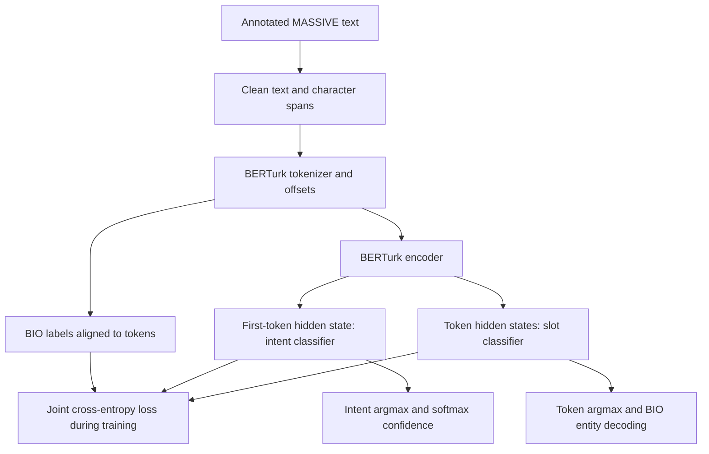

# Turkish Joint NLU with BERTurk

A joint model for **Turkish intent classification and slot filling**. One BERTurk encoder feeds two classifiers. The repository includes training, evaluation, optional Optuna search, terminal inference and a local FastAPI interface.

## Overview

The input is a Turkish utterance such as `yarın sabah yediye alarm kur`. The outputs are an intent label, its model confidence and entity spans such as `date` and `time`. The project uses the Turkish `tr-TR` portion of Amazon MASSIVE and `dbmdz/bert-base-turkish-cased`.

Preparation preserves the official train/validation/test partitions. It checks expected row counts and overlapping row IDs; this is useful protection, but it does not prove that every possible form of leakage is absent.

## Scope and limitations

- This is a supervised NLU study and local inference demo, with a fixed intent and slot vocabulary.
- A valid API response does not establish production readiness or robustness on arbitrary Turkish input.
- Inference truncates at 64 tokenizer tokens. Confidence is the intent softmax score, not calibrated certainty.
- The trained checkpoint is not included in the source checkout. A separately supplied local checkpoint was used for bounded before/after prediction checks. Full historical metric provenance is still incomplete.
- API and CLI preserve their original, different BIO decoding rules. Entity spans can differ on consecutive subwords. They stay separate to avoid changing predictions during this refactor.
- Historical test results have already been inspected. Running the same test again is a historical re-evaluation, not a new unseen evaluation.

## Architecture and workflow



The intent head uses `last_hidden_state[:, 0, :]`; it does **not** use BERT's separate `pooler_output`. The encoder has 12 layers and 768 hidden dimensions. The intent head has 60 outputs. There are 55 raw slot types, represented by **111 BIO labels**: `O`, plus `B-` and `I-` for each type.

```text
total_loss = intent_cross_entropy + lambda_slot * slot_cross_entropy
lambda_slot = 1.5
slot_padding_ignore_index = -100
```

## Project layout

```text
berturk-massive-nlu/
├── src/                         # Core behavior, grouped by learning step
│   ├── data/                    # Parsing, alignment, JSONL, mappings, Dataset
│   ├── modeling/                # Joint neural model and loss
│   ├── training/                # Training epochs and optional Optuna search
│   ├── evaluation/              # Existing test metric calculation
│   └── inference/               # API predictor and original CLI decoder
├── scripts/                     # python -m scripts.<command> entry points
├── api/app.py                   # Thin FastAPI interface
├── configs/joint_bert.yaml       # Used model/training/loss settings
├── data/raw/                    # Unchanged official JSONL partitions
├── data/processed/              # Unchanged intent and BIO ID mappings
├── reports/                     # Recorded historical result provenance
├── docs/                        # Reading guide, refactor notes, API examples
├── pyproject.toml
└── requirements.txt
```

`data/prepare_dataset.py` and the original misspelled `scripts/evaulate_model.py` remain compatibility entry points. Generated `checkpoints/` is not a versioned model artifact.

## Data and artifacts

| Item | Location / meaning |
|---|---|
| Train | `data/raw/train.jsonl`, 11,514 expected rows |
| Validation | `data/raw/validation.jsonl`, 2,033 expected rows |
| Test | `data/raw/test.jsonl`, 2,974 expected rows |
| Intents | `data/processed/intent_to_id.json`, 60 IDs |
| Slots | `data/processed/slot_to_id.json`, 111 BIO IDs |
| Model config | `configs/joint_bert.yaml` |
| Training/API/evaluation checkpoint | `checkpoints/best_joint_nlu_model.pt`, externally supplied |
| Original CLI checkpoint | `best_joint_nlu_model.pt` in repo root, externally supplied |
| Historical result record | [reports/HISTORICAL_RESULTS.md](reports/HISTORICAL_RESULTS.md) |

The two checkpoint paths are an existing inconsistency. No fallback was added, because it could silently select a different model. Use the same externally supplied checkpoint bytes at the path required by the command. Retraining does not recreate identical historical weights.

Raw records and label mappings are retained byte-for-byte. Preparation commands can overwrite them, so they are for deliberate data preparation, not a required step before every evaluation.

## Setup

Python 3.10+ is required. A GPU is optional. The historical README described an RTX 3050 laptop with 4 GB VRAM; this refactor does not establish a new hardware benchmark.

```bash
git clone https://github.com/YavuzahmetR/berturk-massive-nlu.git
cd berturk-massive-nlu
python -m venv .venv
# Linux/macOS: source .venv/bin/activate
# PowerShell: .\.venv\Scripts\Activate.ps1
python -m pip install -e "."
```

`requirements.txt` is the alternative dependency list. Install a compatible PyTorch build for your device if needed. Neither declaration locks the original training environment, so a fresh install is not an exact recreation of that experiment. Preparation needs `datasets`. Model/tokenizer access or a matching cache is required for the original `from_pretrained` calls.

Run commands from the repo root. Original relative artifact paths are retained.

## Usage

### Data preparation, when explicitly needed

```bash
python -m scripts.prepare_data
python -m scripts.generate_slot_mapping
```

These fetch and verify official partitions, save JSONL files, and derive BIO IDs from training metadata. Existing compatibility command: `python -m data.prepare_dataset`.

### Training

```bash
python -m scripts.train
python -m scripts.train --config configs/joint_bert.yaml
```

Saves the state with the lowest validation loss. Historical runtime estimate: 10–12 minutes on the author's RTX 3050 laptop; not remeasured here.

### Evaluation

```bash
python -m scripts.evaluate_model
```

Corrected spelling is available; `python -m scripts.evaulate_model` stays supported. Prints test metrics and per-class reports; it does not currently export a machine-readable release report.

### Terminal inference

```bash
python -m scripts.predict "yarın sabah yediye alarm kurar mısın"
python -m scripts.predict
```

The second opens interactive input. Enter `q`, `quit` or `exit` to leave. This command preserves the legacy root checkpoint path and CLI decoder.

### Local API

```bash
uvicorn api.app:app --reload --host 127.0.0.1 --port 8000
```

| Method | Path | Purpose |
|---|---|---|
| GET | `/` | Service information |
| GET | `/health` | Load status, device and label counts |
| POST | `/predict` | One sentence |
| POST | `/predict/batch` | Up to 64 sentences |

Swagger UI: `http://localhost:8000/docs`. Responses retain `text`, `intent`, `confidence`, `entities`; batches retain `results` and `count`. The model loads once on startup. An empty single-sentence request returns validation error 422. [API requests and Python client](docs/API_EXAMPLES.md) are illustrations, not fresh measurements.
See [API review and first-run steps](docs/API_REVIEW.md) for measured request/response behavior, required external files and known inconsistencies.

### Optional Optuna study

```bash
python -m scripts.tune
```

Runs 10 trials and saves `configs/joint_bert_best.yaml`. Historical runtime estimate: 40–50 minutes. Search evaluates **validation entity-level slot F1**, uses four epochs per trial, batch size 16, AMP off, warmup ratio 0.1, TPE sampling and MedianPruner. These settings differ from normal ten-epoch training.

## Evaluation protocol

| Stage | Selection or metric |
|---|---|
| Normal training | Lowest average validation batch loss; patience 3 |
| Optuna search | Highest validation entity-level slot F1 |
| Final intent evaluation | Accuracy, **weighted** precision/recall/F1; per-class report |
| Final slot evaluation | Entity-level precision/recall/F1 with `seqeval` |
| Secondary slot measure | Token accuracy excluding labels `-100` |

Intent weighted-F1 is not macro-F1. Slot entity F1 is not token accuracy. Validation search and test results must remain separate. Evaluation uses token argmax and ignores padding/special labels; it does not use the API's entity decoder to calculate `seqeval` F1.

Unchanged supplied settings: dropout 0.12, maximum length 64, batch size 16, up to 10 epochs, AdamW learning rate `3e-5`, weight decay 0.01, warmup 15%, maximum gradient norm 1.0, seed 42. AMP, class weights and label smoothing are off. Supported code paths do not mean they were enabled in the recorded final experiment.

## Results and interpretation

These values were **reported by the original README**, not recomputed or verified against checkpoint hashes during this refactor:

| Historical version | Split | Intent weighted-F1 | Slot entity F1 | Slot precision | Slot recall |
|---|---|---|---|---|---|
| v1 reference model | Reported test | 87.54% | 73.94% | 72.25% | 75.70% |
| v3 model | Reported test | 87.99% | 74.16% | 72.34% | 76.06% |
| Optuna best trial | Validation search | — | 68.75% | — | — |

Reported v3 gains: intent +0.45 percentage points, slot +0.22 points. Original v3 example also records intent accuracy 88.03% and slot token accuracy 90.54%. No uncertainty estimates are stored. v1 is an earlier neural reference, not a classical baseline.

Reported v3 changes: slot-loss weight `1.0 → 1.5`, warmup `0.1 → 0.15`, dropout `0.1 → 0.12`. Proposed explanations for them are training hypotheses rather than isolated causal findings.

Optuna history: trial 0 validation slot F1 0.6875 (`lr=1.8e-5`, dropout 0.29, no weights), trial 1 0.1793 (both weights), trial 2 0.6404 (`lr=1.4e-5`, dropout 0.10), trials 3–6 pruned. One weak trial does not show that class weights always fail. Label smoothing in the current loss applies to **intent**, not directly to slots. Current search optimizes validation slot F1; the old claim that it used validation loss is inaccurate for this source.

Search 0.6875 cannot be fairly compared with v1 **test** 0.7394. Full trial logs, original checkpoints and their hashes are absent. [Historical provenance](reports/HISTORICAL_RESULTS.md) retains the numbers and remaining limits.

## Verification

The layout changes include two operational repairs: the training indentation error and the missing correctly spelled evaluation entry point. The earlier checks were recorded on 8 October 2026. The repository does not distribute a software test suite; recorded outcomes remain historical evidence.

Manual baseline comparisons cover parsing, alignment, filtering, collate tensors, both BIO decoders, model-head behavior with a fixed encoder, loss and a training/validation epoch. They compare with the original source, correcting only its indentation error when reading the baseline. A fixed encoder does not substitute for the actual pretrained model or trained checkpoint.

With the supplied local checkpoint and real cached BERTurk tokenizer/encoder, eight fixed CPU samples produced **exactly equal** original/refactored logits and API/CLI outputs, including confidences and entity spans. Single and batch API results were checked separately. The supplied artifact comes from local commit `4b72b6b`, whereas the source baseline is `d7ccd95`; identical label/config bytes and the checkpoint hash are recorded separately.

Before removal, the three tokenizer alignment tests and manual full-model preflight passed offline. Full historical test metrics, training trajectory and real runtime were not rerun or certified unchanged. See [machine-readable historical checks](reports/REFACTOR_VERIFICATION.json).

For a quick local syntax check:

```bash
python -m compileall -q src scripts api data/prepare_dataset.py
```

Use `/docs` to try the service after supplying the checkpoint and pretrained model/tokenizer cache or access. The cleanup compares fixed real-checkpoint HTTP responses before and after removal and checks namespace imports/package discovery. It does not change or remove the scientific `data/raw/test.jsonl` partition or its evaluation command. See [cleanup results](docs/CLEANUP_RESULTS.json) and [API review](docs/API_REVIEW.md).

## Design choices

The code uses ordinary functions and small PyTorch classes. Parsing and alignment are separate from the neural model. Epoch functions keep optimizer, AMP and scheduler order explicit.
Imports point directly to their modules. Python namespace packages allow this layout without package `__init__.py` files; class constructors named `__init__` remain necessary.

Credits: Amazon MASSIVE, BERTurk (`dbmdz`), Hugging Face Transformers, PyTorch, Optuna and FastAPI. No repository license file is present.
